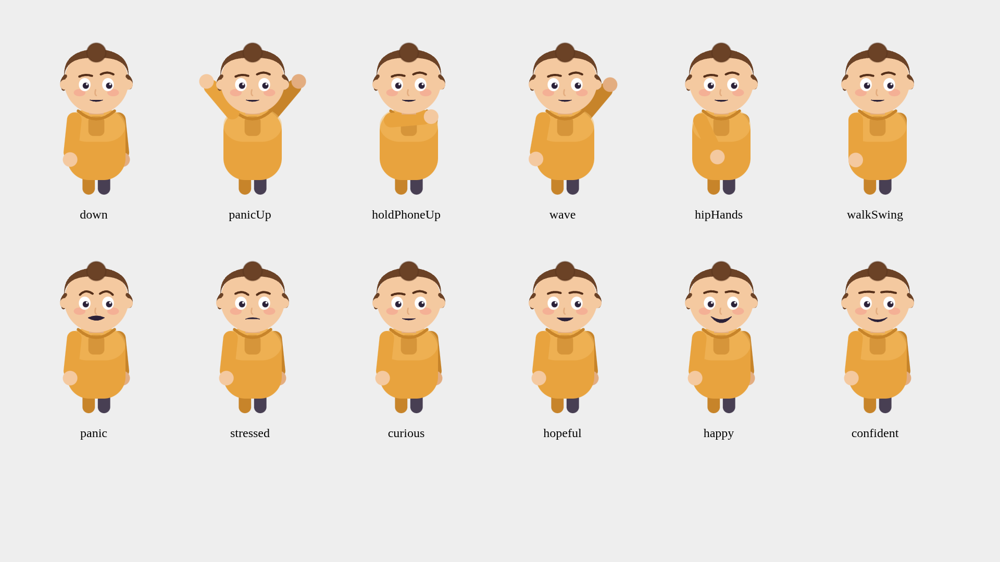
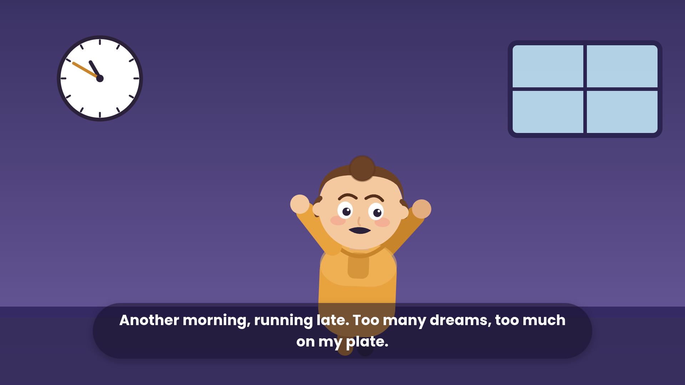
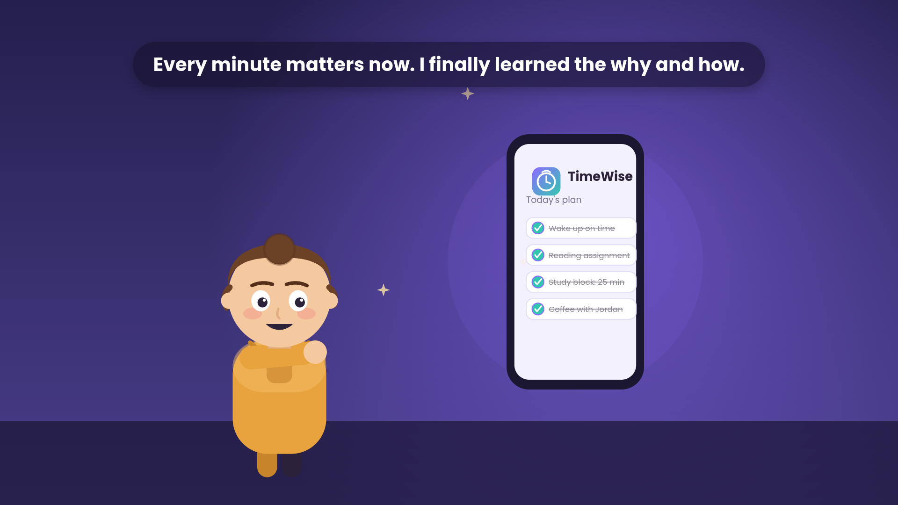
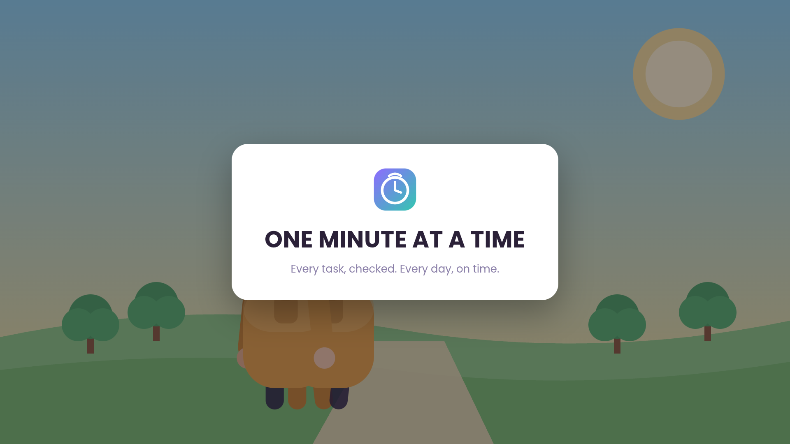

# One Minute at a Time — EX06 Vibe Coding Video

A 60-second, 3-scene animated short about a student who learns to manage her time,
built with an LLM-driven (Vibe Coding) pipeline: **Claude → JSON/Fountain script →
React/Remotion animation → Suno soundtrack → rendered MP4.**

See also: `PRD.md` (what & why), `PLAN.md` (build order), `TODO.md` (checklist),
`prompts.md` (prompts/skills log + prompt-injection & token/cost notes),
`lyrics-analysis.md` (song structure + cue sheet), `../script.json`, `../script.fountain`.

## 1. What's in this repo
```
script.json               ← 3-scene story spec (written first, before any tooling)
script.fountain            ← full Fountain-format screenplay
docs/                       ← this README + PRD/PLAN/TODO/prompts/lyrics docs + screenshots
remotion-project/           ← the Remotion + React app
  src/
    Root.tsx                ← composition registry (MainVideo, + a debug pose-sheet)
    Video.tsx                ← top-level timeline: 3 <Sequence>s + <Audio>
    scenes/                  ← Scene1Chaos, Scene2Discovery, Scene3Success
    components/              ← Character, PhoneApp, ClockChaos, FloatingPapers,
                                Sparkles, CampusBackdrop, CaptionText, TimeWiseLogo
    theme/palette.ts          ← shared color palette
  public/soundtrack.mp3     ← the cut-down, crossfaded 60s soundtrack
  remotion.config.ts         ← render config incl. the Chromium workaround (see §4)
one-minute-at-a-time.mp4    ← final rendered video (also at the project root)
```

## 2. The story (3 scenes, 60s)
| Scene | Time | Beat | Song section used |
|---|---|---|---|
| 1 — The Chaos | 0:00–0:20 | Maya oversleeps, room in chaos, misses the bus | Verse 1 |
| 2 — The Discovery | 0:20–0:40 | Finds the **TimeWise** app; checklist blooms in | Chorus |
| 3 — The Turnaround | 0:40–1:00 | Confident walk to campus, on time; title card | Bridge |

Full detail (why these exact cut points, rhyme-scheme notes) is in `lyrics-analysis.md`.

## 3. Visual style
Disney/Pixar-*inspired* flat 2D vector animation — rounded shapes, warm palette,
squash-and-stretch motion — built entirely from SVG + React, animated with Remotion's
`interpolate`/`spring` primitives. **No photoreal AI image-generation tool was available
in the build environment**, so this project deliberately leans into a fully code-driven
illustration style rather than silently producing a lower-effort result. See
`docs/screenshots/` for the character pose sheet and in-context scene stills.

| Pose/mood sheet (QA tool, see §6) | Scene 1 | Scene 2 | Scene 3 (title card) |
|---|---|---|---|
|  |  |  |  |

## 4. Environment workarounds (full transparency)
Two constraints in the build sandbox required deviating from the course's default
recipe; both are documented here rather than hidden:

1. **Chromium download blocked.** Remotion needs a headless Chromium to rasterize
   frames; by default it downloads one from `remotion.media` or
   `storage.googleapis.com`. Both hosts were unreachable from the sandbox's
   network-allowlisted proxy (`curl` → connection refused; `registry.npmjs.org` and
   `github.com` worked fine). Fix: installed `@sparticuz/chromium` (a Linux x64
   Chromium build distributed *as an npm package*, so it downloads over the
   already-allowed npm registry) and pointed Remotion at it directly:
   ```ts
   // remotion.config.ts
   Config.setBrowserExecutable('/…/chromium'); // extracted via @sparticuz/chromium
   ```
2. **2 CPU cores, no GPU, and a per-command wall-clock budget.** A full 1920×1080
   render of this composition was measured at **~0.58s/frame**; at 1800 frames that's
   >17 minutes in one continuous process, which does not fit the sandbox's execution
   model. Measured alternatives:

   | Resolution | Measured rate | 1800-frame estimate |
   |---|---|---|
   | 1920×1080 | ~0.58 s/frame | ~17.4 min |
   | **1280×720 (used)** | **~0.34 s/frame** | **~10 min** |
   | 960×540 | ~0.24 s/frame | ~7.3 min |

   Chose **1280×720** as the best quality/time trade-off, then rendered in ~90–120
   frame chunks (`remotion render … --frames=A-B`), and losslessly re-joined the chunks
   with `ffmpeg -filter_complex concat` (frame-accurate re-encode, not a container-level
   stream copy, to avoid the timestamp drift that a plain `concat` demuxer produced —
   verified via `ffprobe -count_frames`: exactly 1800 frames, 60.000s, before vs. after).
   The soundtrack was muxed back on *once*, from the single clean `soundtrack.mp3`, to
   avoid any AAC re-encode artifacts at chunk boundaries.

## 5. How to build it yourself (course's reference workflow)
```bash
cd remotion-project
npm install
npx remotion studio src/index.ts        # live preview
npx remotion render src/index.ts MainVideo out/final.mp4   # full render
```
If your environment can reach `remotion.media`/`storage.googleapis.com` normally, you
can delete the `Config.setBrowserExecutable(...)` line in `remotion.config.ts` and skip
installing `@sparticuz/chromium` — Remotion will download its own Chromium as usual.

## 6. Development results, sanity checks & iteration (course rubric: "development
results / comparisons of attempts")
A temporary second composition, `DebugSheet` (`src/DebugSheet.tsx`, registered in
`Root.tsx` alongside `MainVideo`), renders every mood (6) × arm-pose (6) combination on
one still image. This was the project's substitute for unit tests on a visual
component: one `npx remotion still … DebugSheet` call surfaces every pose at once.

It caught a real bug: the first `panicUp` pose rotated the arm so the hand landed
*behind* the head circle (invisible, since the head is painted last) — mathematically
plausible-looking code that silently produced a broken visual. Compare:
- **Before fix:** `docs/screenshots/pose-sheet-v1-before-fix.png` (panic arms barely lift)
- **After fix:** `docs/screenshots/pose-sheet-final.png` (clear "hands up" panic gesture)

Other sanity checks performed before the full render: `ffprobe -count_frames` to
confirm exact frame counts after chunked rendering/concatenation; still-frame renders
of representative frames from every scene reviewed as images before committing to the
~10-minute full render; caption overlap caught and fixed (`CaptionText` gained an
`exitFrame` fade-out after two lyric lines were found stacked on-screen at once).

## 7. Prompt injection & token/cost awareness
See `prompts.md` §5–6 for the full discussion (how untrusted file content — the course
PDF, the mp3's embedded lyrics tag — was kept as inert data rather than re-injected as
instructions; and a discussion of where this session's token/time budget went and how
that shaped the chunked-render / still-frame-first workflow).

## 8. Known limitations & possible extensions
- No discrete SFX audio layer (alarm beep, paper rustle, UI chime, footsteps, clap) —
  currently represented **visually** (spinning clock, flying papers, sparkle bloom,
  high-five pose). Adding real SFX (e.g. via a free CC0 SFX pack, mixed with `ffmpeg`
  the same way the soundtrack was cut/crossfaded) is the natural next step and was
  scoped out only for time, not overlooked — see `TODO.md`.
- Rendered at 720p rather than 1080p for sandbox compute-budget reasons (§4); the
  `Root.tsx` `WIDTH`/`HEIGHT` constants are the only thing to change to re-render at
  1080p on a machine with more CPU headroom (all scene SVGs use a 1920×1080 `viewBox`
  already, so they upscale losslessly).
- Character is a single reusable rig (`Character.tsx`) driven entirely by props
  (`mood`, `armPose`, `walkPhase`, …) rather than per-scene bespoke art — this was a
  deliberate scope choice so the same component could be QA'd once (§6) and trusted
  everywhere, rather than debugging bespoke poses in three separate scene files.

## 9. Sources
- Course material: *Multimedia Vibecoding V7.3.0* (Dr. Segal Yoram), chapters 1–7,
  provided as `L09-and-EX06-Book-Multimedia-VIBE-CODING.pdf`.
- [Remotion documentation](https://www.remotion.dev/docs) — Composition/Sequence/Audio
  APIs, `renderMedia`/CLI render flags, `Config.setBrowserExecutable`.
- [Fountain screenplay format](https://fountain.io/syntax/) — used for `script.fountain`.
- [@sparticuz/chromium](https://github.com/Sparticuz/chromium) — Chromium binary
  distributed via npm, used as the environment workaround described in §4.
- Suno AI — soundtrack generation (song produced by the student prior to this session).
